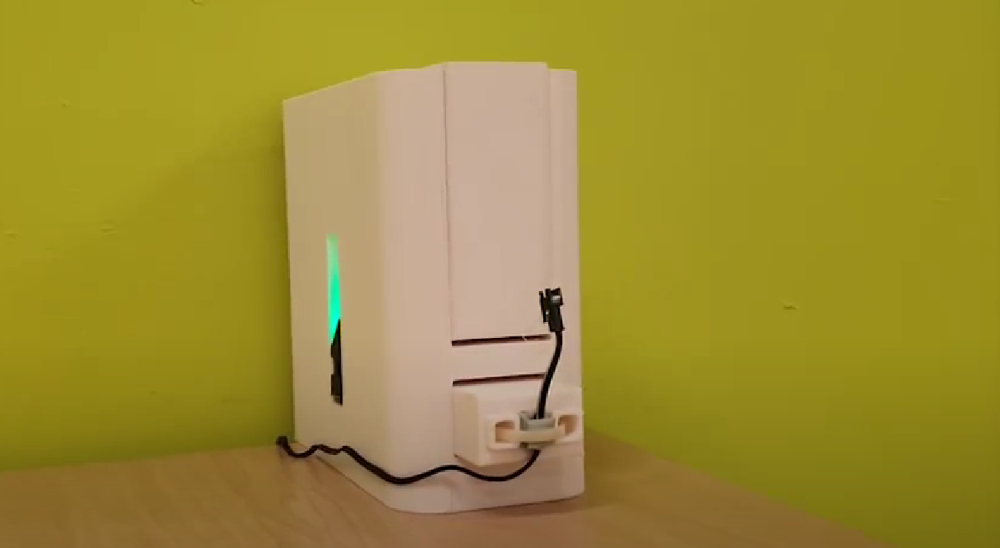
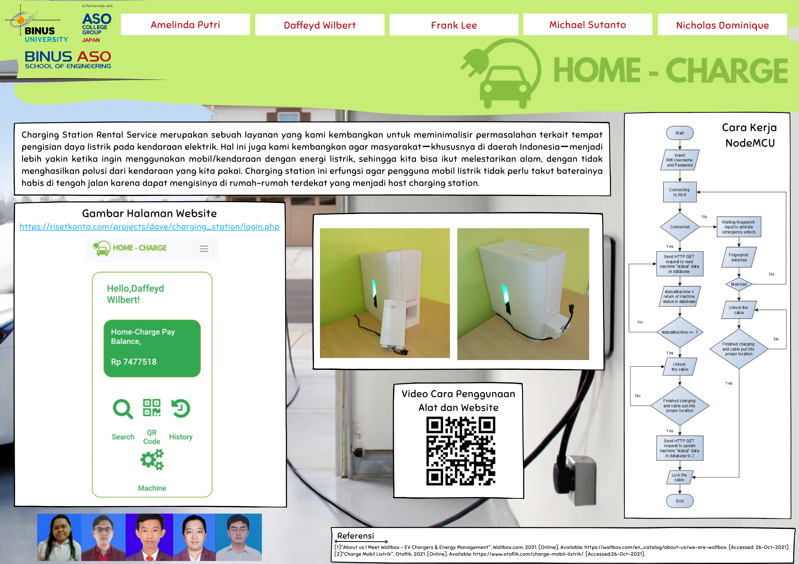

# Home Charge for Electric Vehicle 2021
This project help you to connect the person who have their electric vehichle batery low with the person who has space and charging tools in them house, This system work like renting place, all the transaction can be done online or cash.

---

### Table of Contents

- [Description](#description)
- [Documentation](#documentation)
- [Author Info](#author-info)

---

## Description

This project is using the NodeMCU, this project outcome is to make tool that can lock the cable of charging tools to unlock it you should scan the barcode at the charging tools, the duration and the cost will automatically get into the person that using the charging station. All the information history, charging station location, charging activity, cost, detail cost, and direction can be accessed by the website.

#### Technologies

- MySQL Databases
- API

[Back To The Top](#Home-Charge-for-Electric-Vehicle)

---

## Documentation

[Demo Video](https://drive.google.com/file/d/113WAyqdhLdUWw8V_o2YXFsh2D-SguBSv/view?usp=sharing)

[Back To The Top](#Home-Charge-for-Electric-Vehicle)

---
## Author Info

- Instagram - [daffeydwilbert](https://www.instagram.com/daffeydwilbert/)
- Email - daffeydwilbert@gmail.com

[Back To The Top](#Home-Charge-for-Electric-Vehicle)
